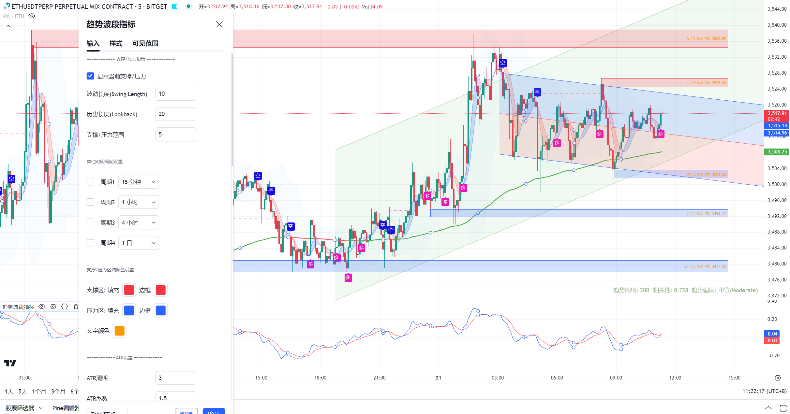
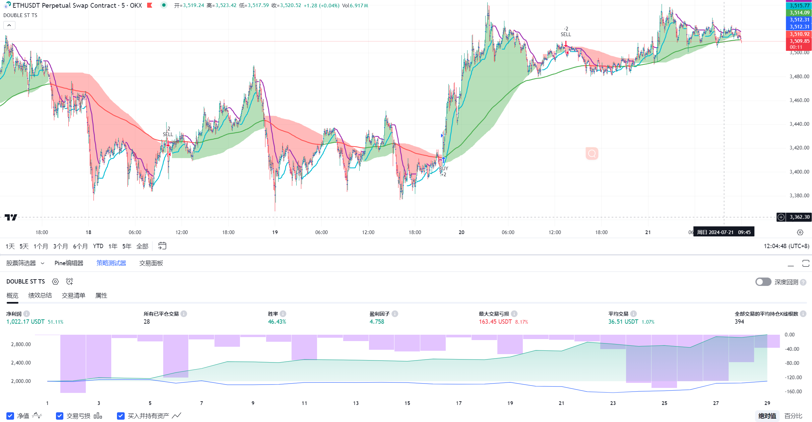

# 技术能力
1. 支持使用Python/Java定制、开发交易平台及策略
2. 支持使用PineScript（TradingView）， MQL4/5（MT4/MT5）定制、开发策略
3. 可将Pine或MQL4/5脚本转为Python/Java自动化执行

# 写在前面
1. 投资有风险，入市需谨慎。所有策略仅供参考，不构成任何形式的投资建议。
2. 请在投资交易过程中，请时刻保持理性，严格遵守市场规则，理性投资，莫贪莫侥幸。

# 趋势指标
* 趋势指标使用的主要技术指标有：布林带，TSI，均线，ATR，支撑压力位，趋势探测等
* 该策略的核心优势在于：
	1. 多维度分析，精准研判市场趋势: 融合趋势追踪、支撑压力位、市场波动强度等多项指标，深入剖析市场走势，精准把握趋势方向，助您研判市场先机。
	2. 及时提示交易信号，助您抓住获利良机: 综合多空指标，精准识别当前市场趋势，及时提示交易者进场或出场时机，让您不错失任何获利机会。
	3. 动态识别支撑压力，科学止损止盈: 动态识别支撑压力位，科学设置止损止盈，帮助您有效控制风险，锁定收益，实现稳健投资。
	4. 灵活运用，适应多变市场: 技术指标并非一成不变，策略强调灵活运用，结合市场实际情况和个人风险偏好，优化交易策略，助您在瞬息万变的市场中从容应对。

* TradingView中的趋势波段指标展示

* TradingView中的双重趋势策略展示

